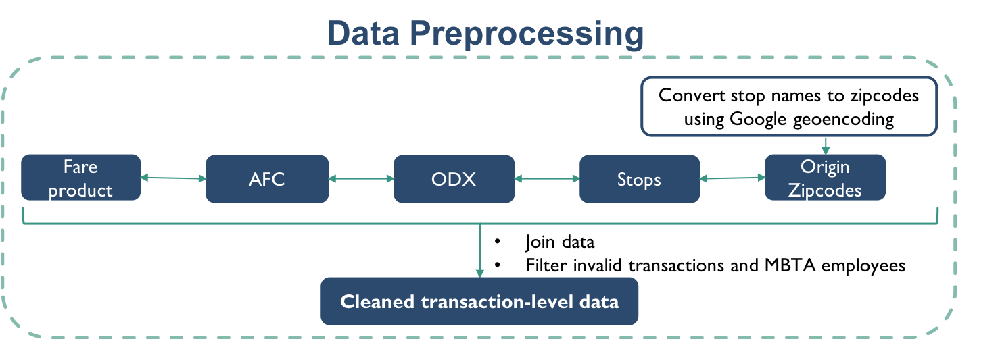
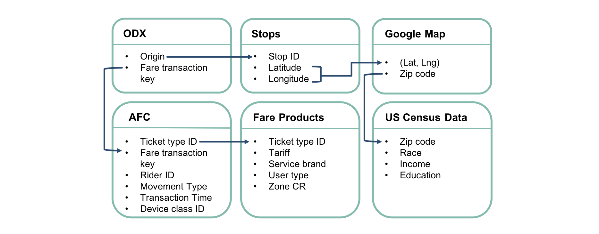
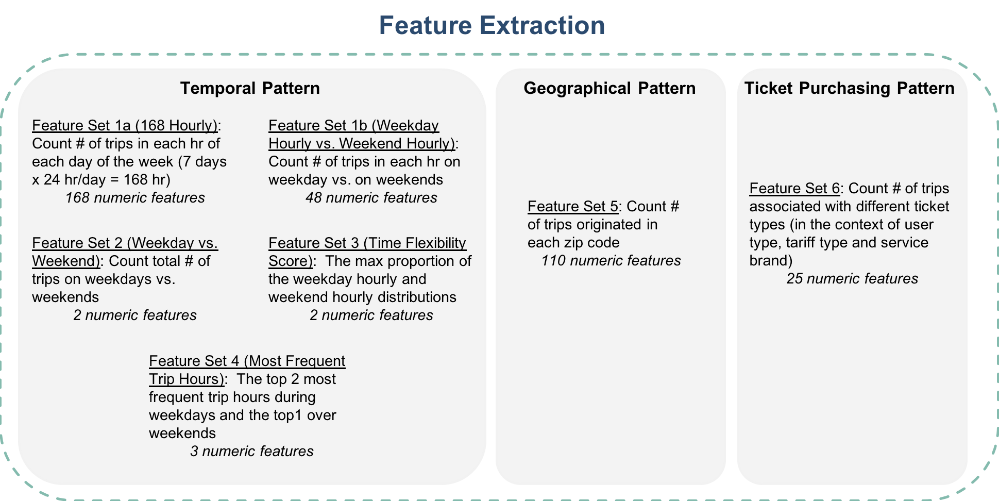
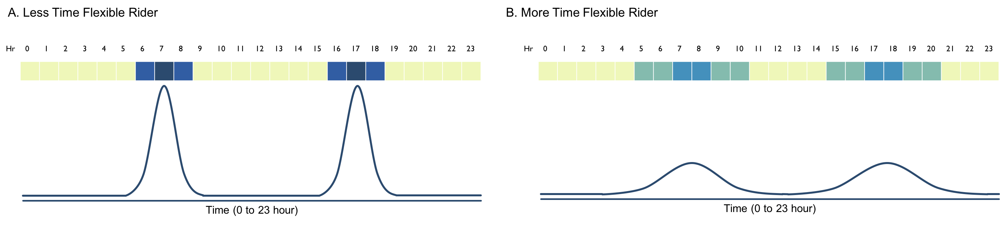
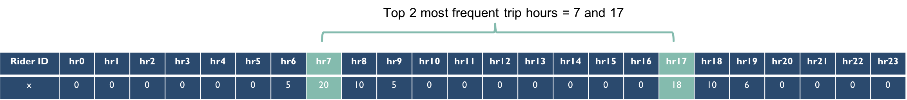
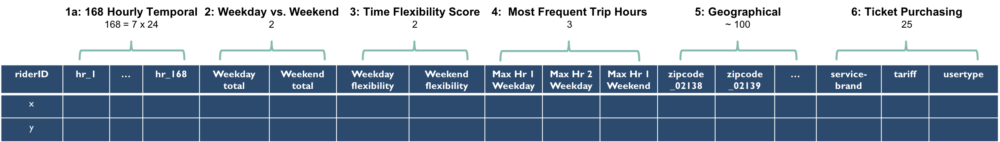
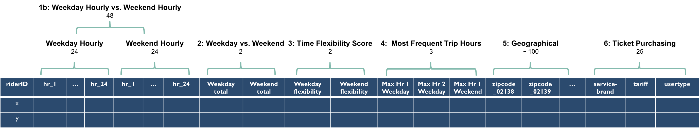
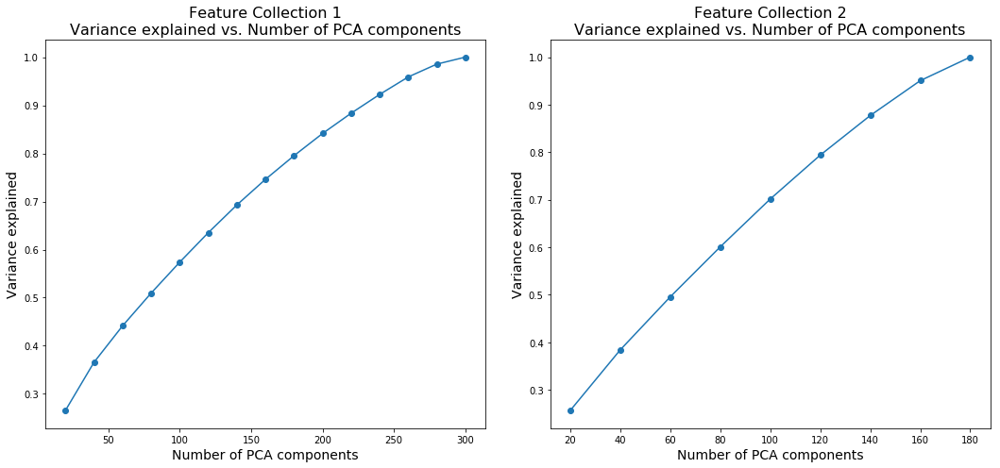

## Contents
{:.no_toc}
*  
{: toc}

## Data Preprocessing

### Data sources

Recall that we have the following data sources to process:

- **MBTA Automated Fare Collection (AFC):** monthly transaction-level data from November 2016 to November 2017, each file is about 2GB, containing over 20,000,000 records.
- **MBTA Fare product** data containing fare product definitions
- **MIT/MBTA ODX** data containing transaction-level origin/destination inference from November 2016 to November 2017
- **MBTA Stops** data containing information about a total of around 9000 stations/stops.
- **GoogleMap Geoencoding API**, which maps longitude and latitude coordinates to zip codes
- **US Census** data containing demographics information by zip codes
- **MBTA sales** data containing sales channel and card affiliations (We did not use this because it was not hashed the same way as other data sources, so we could not the match records.)

### Data Preprocessing Procedure

Our overall data prepcressing procedure is summarized in Figure 1. Briefly, we first converted station latitude and longitude to zip codes using Google Map Geoencoding API. We then joined the relevant fields from each data source according to Figure 2. Finally, we filtered out the invalid transactions, movement types, device class IDs as well as records that appear to be from MBTA employees and records that lack an origin. The end of this process is a large data frame where each row is a transaction.

| |
|:--:|
| ***Figure 1: Data Preprocessing*** |

| |
|:--:|
| ***Figure 2: Fields Used and Strategy to Join Data Sources*** |

**Note on using the ODX data**: We only used the origin field as it is the most reliable and consistently predicted/collected field. We did not use the inferred destinations and other related fields such as predicted trip duration because there were inconsistent number of missing predictions per rider. Incorporating these fields would result in having to drop inconsistent number of records (those with missing predictions) across riders, thereby causing bias.

**Note on filtering out invalid data**: Below is a general description of how we filtered out invalid data. For details, please consult our [Code Documentation](https://ac297r-mbta-2018.github.io/Code-Documentation/).

- For *invalid transactions*: We wrote a Python script to detect transactions that have the same transaction time but negated amount
- For *movement type*: We kept only validation_movementtype = [7, 20]
- For *device class ID*: We kept only station_deviceclassid = [411, 412, 441, 442, 443, 501, 503]
- For *filtering MBTA employees*: we dropped transaction records associated with MBTA employees (tickettypeid = [606000700, 606001400])

## Feature Extraction

After the preprocessed transaction-level data is grouped by rider ID, we extracted several sets of rider-level pattern-of-use features, with which we made 2 feature collections (combinations of different feature sets).

The feature sets we extracted are summarized in Figure 3. We defined 3 general categories of usage patterns (i.e. temporal, geographical and ticket purchasing). Since our client had expressed most interest in understanding and clustering riders based on when they ride, we focused our efforts on dissecting the temporal patterns from several different angles.

| |
|:--:|
| ***Figure 3: Feature Extraction*** |

### Temporal Patterns
#### Feature Set 1a: 168 Hourly version
For each rider, we counted the number of trips he/she took in each hour (0:00 to 23:00) of each day of week (Mon to Sun) for the user-specified length of duration and starting month. For instance, suppose the desired duration is 1 month and starting month is October 2017; then, for the hour at Monday 9AM, we counted the number of trips each rider took during 9AM on all of the Mondays in October 2017. Therefore, in this case, the temporal pattern of each rider is represented by a 7 (day) by 24 (hour/day) matrix that is then flattened to a 168-dimensional vector, within which each element is a numeric feature. This is the same temporal representation found in *Mahrsi et al. (2014). Understanding Passenger Patterns in Public Transit Through Smart Card and Socioeconomic Data. UrbComp.* This way of representing temporal usage patterns appears most intuitive to us.

#### Feature Set 1b: 48 (Weekday Hourly vs. Weekend Hourly) version

Machine learning algorithms suffer from "the curse of dimensionality" in general, and unsupervised learning algorithms are not an exception. For more information on this topic, see [The Challenges of Clustering High Dimensional Data](https://www-users.cs.umn.edu/~kumar001/papers/high_dim_clustering_19.pdf). Therefore, we attempted to reduce the dimensionality of the 168 hourly pattern with the goal of retaining interpretable temporal features. We divided the 7 by 24 hour matrix into weekday versus weekend and each then can be reduced to a 1 by 24 vector by taking daily sums, producing a set of 48 numeric features（See Figure 4). Doing so, we got rid of a total of 120 features.

| |
|:--:|
| ***Figure 4: Strategy to Reduce the Dimensionality of the 168 Hourly Usage Patterns (Feature Set 1a)*** |

#### Feature Set 2: Weekday vs. Weekend Total Counts

Another approach to reduce the dimensionality of temporal usage pattern was to count the total number of trips each rider took on weekday and on weekends. This effectively is the row sums of Weekday Hourly vs. Weekend Hourly features (Feature Set 1b).

#### Feature Set 3: Time Flexibility Score

One of the key interpretations we would like to make is whether a rider is flexible in their trip schedule. To represent time flexibility, we first normalized the weekday hourly and weekend hourly patterns independently. The normalized vectors can be interpreted as probability distributions of hourly usage on either weekday or weekend. A less time flexible rider would then have a distribution with a higher max than a more time flexible rider as depicted in Figure 5. Therefore, we used the maxes of the weekday and weekend distributions to represent rider time flexibility. A more flexible rider would thus have a lower score.

| |
|:--:|
| ***Figure 5: Schematics Comparing Less to More Flexible Rider Temporal Distribution*** A. A less flexible rider would have higher and more concentrated peaks. B. A more flexible rider would have lower and more spread out peaks.|

#### Feature Set 4: Most Frequent Trip Hours
It makes intuitive sense to cluster riders who ride at similar times. Therefore, we extracted the hours during which each rider took the most trips. We chose to extract the top 2 most frequent trip hours for weekdays and the top 1 for weekends. The idea is that we would want to compare commute times during weekdays for commuters and peak time for random/weekend riders during weekends. In practice, this is simply the corresponding column index (hour) of the maxes of Weekday Hourly vs. Weekend Hourly patterns.

An example of the top 2 most frequent trip hours during weekdays is shown in Figure 6.

| |
|:--:|
| ***Figure 6: Example of Extracting the Top 2 Most Frequent Trip Hours During Weekdays for One Rider*** |

### Geographical Patterns

To represent rider geographical usage patterns, we counted the number of trips rider took in each zip code. We chose to summarize geographical usage pattern at the zip code level for 2 reasons: 1) Counting at the stop level would produce too many features (approximately 8000); and 2) The census data is provided at the zip code level, so counting at the zip code level would facilitate demographics inference. This gives a total of around 100 numeric features (Feature set 5).

### Ticket Purchasing Pattern

To represent rider ticket-purchasing habits, we counted the number of trips associated with different ticket types (in the context of user type, tariff type and service brand) for each rider. This give a total of 25 numeric features (Feature set 6).

## Feature Collections

Two combinations of features sets were made for comparison.

- **Feature collection 1:** Feature sets 1a (168 Hourly), 2 (Weekday vs. Weekend Total Counts), 3 (Time Flexibility Score), 4 (Most Frequent Trip Hours), 5 (Geographical Patterns by Zip Code), and 6 (Ticket Purchasing Pattern). *This collection has a total of 310 features*.

    | |
    |:--:|
    | ***Figure 7: Feature Details for Feature Collection 1*** |

- **Feature collection 2**: Feature sets 1b (Weekday Hourly vs. Weekend Hourly), 2 (Weekday vs. Weekend Total Counts), 3 (Time Flexibility Score), 4 (Most Frequent Trip Hours), 5 (Geographical Patterns by Zip Code), and 6 (Ticket Purchasing Pattern). *This collection has a total of 190 features*.

    | |
    |:--:|
    | ***Figure 8: Feature Details for Feature Collection 2*** |

## Additional Dimension Reduction Approaches
### Principal Component Analysis (PCA)

Principal component analysis (PCA) is a statistical procedure that uses an orthogonal transformation to convert a set of observations of possibly correlated variables into a set of values of linearly uncorrelated variables called principal components ([Wikipedia](https://en.wikipedia.org/wiki/Principal_component_analysis)). More information can also be found in [Sklearn documentation](http://scikit-learn.org/stable/modules/generated/sklearn.decomposition.PCA.html).

We experimented with PCA transformation as an additional dimension reduction approach. However, as Figure 9 below shows, the almost linear dependency between variance explained and number of components suggest that PCA is not an effective method for dimension reduction in the context of our problem.

| |
|:--:|
| ***Figure 9: Variance Explained vs. Number of PCA Components*** |

## Summary Findings

- **Dimension Reduction with PCA**: We did not pursue this avenue because it is ineffective as shown in Figure 9 and discussed above.
- **Feature Collection 1 vs. Feature Collection 2**: Both the monthly segmentation results and the computation times are very similar between these two feature collections. ***We chose Feature Set 1 for this project***. However, we suspect that Feature Set 2 may have some benefits and may even produce more interpretable clusters with a larger training data set (due to reduced data dimensionality). It would be easy to make such adjustment as the feature extraction function extracts all feature sets.
