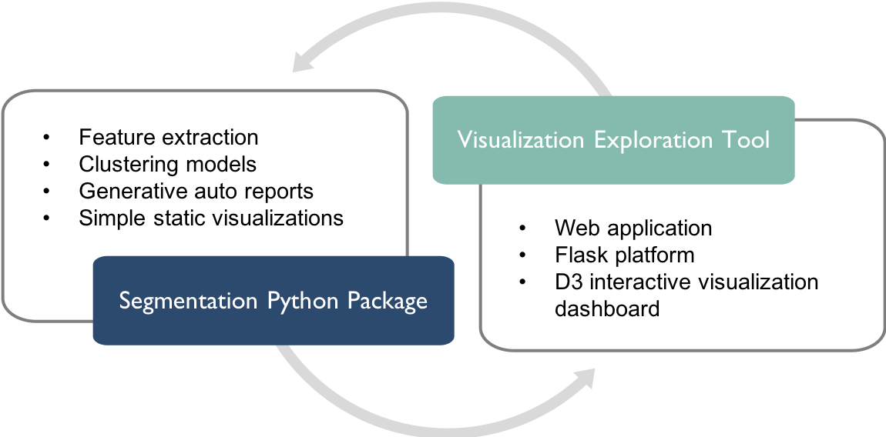
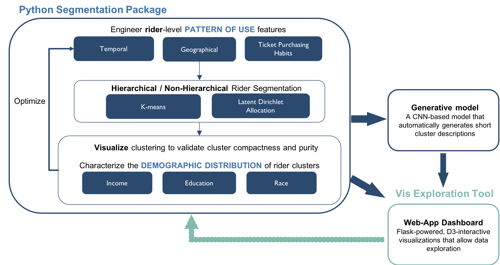
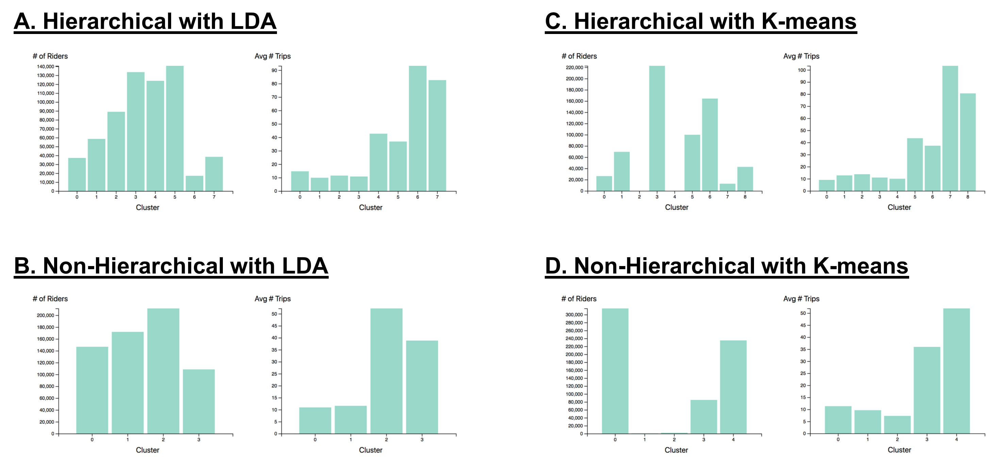
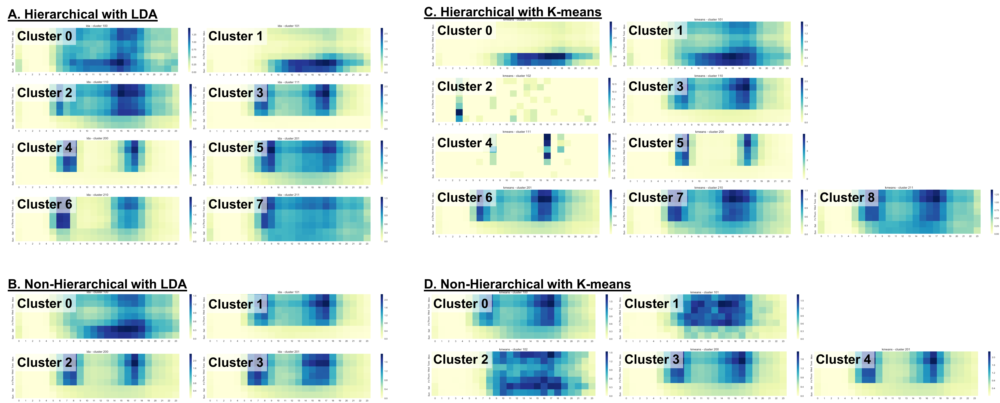
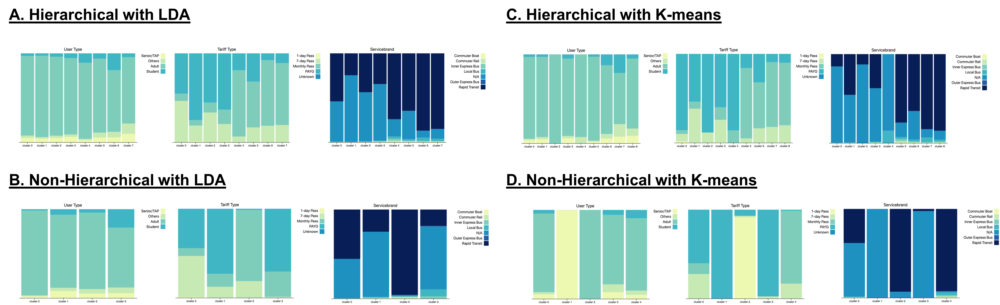
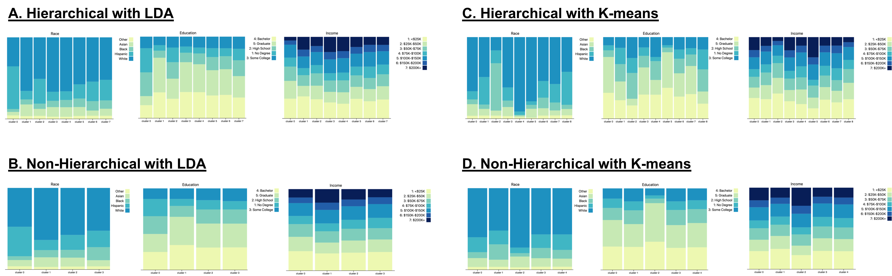

## Contents
{:.no_toc}
*  
{: toc}

## Team
Harvard 2018 Spring AC297r Capstone Project: Chia Chi (Michelle) Ho, Yijun Shen, Jiawen Tong, Anthony Hou

## Motivation & Problem Statement  

The Massachusetts Bay Transportation Authority (MBTA) is the largest public transportation agency in New England, delivering a complex system of subway, bus, commuter rail, light rail, and ferry services to riders in the dynamic economy of the Greater Boston Area. It is estimated that MBTA provides over 1.3 million trips on an average weekday. While MBTA collects a wealth of trip transaction data on a daily basis, a persistent limitation has been the organization’s lack of knowledge around rider groups and their respective ridership habits. Understanding rider segmentation in the context of pattern-of-use has significant implications in developing new policies to improve its service planning and in potentially changing its fare structure. Therefore, we aim to develop a flexible, reusable rider segmentation model on MBTA’s “core system” (encompassing local buses and subway) that can group individuals according to pattern-of-use dimensions.

## Project Deliverables

**Our project deliverables are:**

- A reusable Python segmentation package that clusters riders and infers rider group characteristics.
- A web-based visualization exploration tool intended to facilitate the discovery of business and ridership insights.

| |
|:--:|
| ***Figure 1: Project Deliverables*** |

**The specific goals of each project deliverables are**:
- For the Python segmentation package -
    - Develop a method to extract rider-level pattern-of-use features (temporal, geographical and ticket purchasing) from transaction data based on user-specified length of duration and starting month
    - Develop a method to cluster riders using unsupervised learning algorithms based on extracted features and user-specified weights on temporal patterns
    - Develop a method to profile rider clusters using demographics information
    - Develop a generative model that automatically generates simple reports describing rider clusters
    - Implement simple static visualization functions to display various rider segment characteristics

- For the visualization exploration tool -
    - Implement a fully dynamic web-based application with a Flask backend to display interactive D3 visualizations for data exploration (App with full functionality, not deployed to the web)
    - Implement a static version of the full app that displays the same interactive D3 visualizations without a Flask backend (App with limited functionality, deployed using Github pages)

Note: In addition to the code base, we are delivering pre-ran monthly clustering results for Dec 2016 to Nov 2017 with equal weighting on temporal, geographical and ticket purchasing patterns. This set of cached results are the data available for display on the Github version of our dashboard.

**Our Github Organization:**

Source code can be found on our Github organization (https://github.com/AC297r-MBTA-2018). It contains 4 repositories:

- ***Rider-Segmentation-Full-App*** - This is the code base for both the Python segmentation package and the app with full functionality (i.e. based on user input, the app is able to send clustering requests to the Flask backend on a new data set or user-specified weights/duration that has not been cached. *Disclaimer: The full input source is not available on Github for security reasons, and each new clustering request takes at least several hours*.)  
- ***Dashboard*** - This is the static version of the full app that has limited functionality (The app is only able to display pre-ran monthly clustering results for Dec 2016 to Nov 2017 with equal weighting on temporal, geographical and ticket purchasing pattern.) The app is deployed as a Github page (https://ac297r-mbta-2018.github.io/Dashboard/).
- ***Final-Report*** - This repository hosts the final report which is deployed as a Github page (https://ac297r-mbta-2018.github.io/Final-Report/).
- ***Code-Documentation*** - This repository hosts the code documentation which is deployed as a Github page (https://ac297r-mbta-2018.github.io/Code-Documentation/).

Note: The limited Dashboard, Final Report and Code Documentation are linked via a navigation bar on respective Github pages.

## Data Description

Available data sources:

- **MBTA Automated Fare Collection (AFC)** data containing transaction-level data from November 2016 to November 2017
- **MBTA Fare product** data containing fare product definitions
- **MIT/MBTA ODX** data containing transaction-level origin/destination inference from November 2016 to November 2017
- **MBTA Stops** data containing information about each station/stop
- **GoogleMap Geoencoding API**, which maps longitude and latitude coordinates to zip codes
- **US Census** data containing demographics information by zip codes
- **MBTA sales** data containing sales channel and card affiliations (We did not use this because it was not hashed the same way as other data sources, so we could not match the records.)

The features we used and how we merged different data sources are summarized in Figure 2.

| |
|:--:|
| ***Figure 2: Data Structure*** |

## Literature Review

1. Case Study in France: (*Mahrsi et al. (2014). Understanding Passenger Patterns in Public Transit Through Smart Card and Socioeconomic Data. UrbComp.*)

    In this paper, the authors presented an approach to mine passenger temporal behaviors in order to extract interpretable rider clusters. Briefly, each rider is represented as a vector of 168 features, where each feature is the number of trips the passenger took in a certain hour of a certain day of week (24 hours/day x 7 days a week = 168 hours/week). Using a mixture unigram model, they obtained a set of 16 temporal clusters, each describing a temporal mobility pattern. Such patterns include typical commuter patterns, different morning peak times and different travel behaviors on weekends. To infer cluster socioeconomic characteristics, the authors first used a Hidden Random Markov Field model and the US census data to cluster residential neighborhoods based on socioeconomic characteristics. The riders were then assigned a socioeconomic class based on their inferred residential location. The authors found that the temporal clusters differed in their inferred socioeconomic distributions.

2. Case Study in London: (*Langlois et al. (2015). Inferring patterns in the multi-week activity sequences of public transport users. Transportation Research Part C.*）

    In this study, the authors investigated passenger heterogeneity based on a longitudinal representation of each user’s multi-week activity sequence derived from smart card data. Then, they identified clusters of users with similar activity sequence structure. The application reveals 11 clusters, each characterized by a distinct sequence structure. Combined with demographic attributes including passenger age, occupation, household composition and income, and vehicle ownership from a small sample of users, the analysis revealed that significant connections exist between the user demographic attributes and activity patterns identified exclusively from fare transactions.

## Modeling Approach Overview

Our overall modeling approach is summarized in Figure 3.

| |
|:--:|
| ***Figure 3: Modeling Approach Overview.** The approach is presented in the context of the overall structure of our project deliverables. Elements belonging to the Python segmentation package and visualization exploration tool are colored in dark blue and light blue-green, respectively.* |

## Feature Sets
- **168 Hourly Temporal Patterns**: The number of trips each rider took in each hour (0:00 to 23:00) of each day of week (Mon to Sun), a 168-dimensional vector.
- **Weekend-vs-Weekday**: The total number of trips each rider took on weekday and on weekends.
- **Most Frequent Trip Hours**: The top 2 hours in which each rider takes most trips during weekdays, and the top 1 hour over weekends.
- **Time Flexibility Scores**: The maxes of the weekday and weekend ridership distributions.
- **Geographical Patterns by Zip Codes**: The number of trips each rider took in each zip code.
- **Ticket Purchasing Patterns**: The number of different service-brands, tariff (e.g. 7-day pass, monthly pass, Pay-as-you-go) and user-type associated with each rider ID.

## Sample Results

Since there are too many combinations of month/pipeline/algorithm, we only present the results for Oct 2017. Please see our dashboard (https://ac297r-mbta-2018.github.io/Dashboard/) to explore more results.

### Comparing Cluster Statistics

| |
|:--:|
| ***Figure 4: Simple Cluster Statistics Comparison.** Number of riders and average number of trips of clusters found using -  A. The hierarchical pipeline and the LDA algorithm; B. The non-hierarchical pipeline and the LDA algorithm; C. The hierarchical pipeline and the K-means algorithm; D. The non-hierarchical pipeline and the K-means algorithm.* |

### Comparing Cluster Temporal Patterns

Figure 5 shows the comparison of cluster temporal patterns found using different methods. All methods found distinct temporal patterns across different clusters. In general, the interpretations of these clusters are similar (e.g. weekend rider vs. commuters vs. random riders), but the hierarchical pipeline implementation found more subtle differences between clusters compared to the non-hierarchical pipeline.

| |
|:--:|
| ***Figure 5: Cluster Temporal Patterns Comparison.** Temporal patterns of clusters found using - A. The hierarchical pipeline and the LDA algorithm; B. The non-hierarchical pipeline and the LDA algorithm; C. The hierarchical pipeline and the K-means algorithm; D. The non-hierarchical pipeline and the K-means algorithm.* |

### Comparing Cluster Geographical Patterns

| |
|:--:|
| ***Figure 6: Selected Cluster Geographical Patterns Comparison.** Geographical patterns of clusters found using  - A. The hierarchical pipeline and the LDA algorithm; B. The non-hierarchical pipeline and the LDA algorithm; C. The hierarchical pipeline and the K-means algorithm; D. The non-hierarchical pipeline and the K-means algorithm.* |

### Comparing Cluster Ticket Purchasing Patterns

| |
|:--:|
| ***Figure 7: Cluster Ticket Purchasing Patterns Comparison.** Ticket purchasing patterns of clusters found using -  A. The hierarchical pipeline and the LDA algorithm; B. The non-hierarchical pipeline and the LDA algorithm; C. The hierarchical pipeline and the K-means algorithm; D. The non-hierarchical pipeline and the K-means algorithm.* |

### Comparing Inferred Cluster Demographics

| |
|:--:|
| ***Figure 8: Inferred Cluster Demographics Comparison.** Inferred demographics distributions of clusters found using -  A. The hierarchical pipeline and the LDA algorithm; B. The non-hierarchical pipeline and the LDA algorithm; C. The hierarchical pipeline and the K-means algorithm; D. The non-hierarchical pipeline and the K-means algorithm.* |

### Sample Report
Sample of automatically generated reports for clusters found using the **Hierarchical** pipeline and the **LDA** algorithm:

- For Cluster 1

    > The predicted type of rider for this cluster is weekend riders. There are 58597 riders in the cluster, taking 9.89 trips on average. The cluster overall shows most traffic during 18:00-19:00 and 17:00-18:00 on weekdays, and during 17:00-18:00 on weekends. The most frequent trip origin is in zipcode 02115.

- For Cluster 4

    > The predicted type of rider for this cluster is less flexible commuters with normal commute hours. There are 123792 riders in the cluster, taking 42.78 trips on average. The cluster overall shows most traffic during 7:00-8:00 and 8:00-9:00 on weekdays, and during 15:00-16:00 on weekends. The most frequent trip origin is in zipcode 02110.

Sample of automatically generated reports for clusters found using the **Non-Hierarchical** pipeline and the **K-means** algorithm:

- For Cluster 2

    > The predicted type of rider for this cluster is weekend riders who also ride over weekdays. There are 2176 riders in the cluster, taking 7.3 trips on average. The cluster overall shows most traffic during 16:00-17:00 and 17:00-18:00 on weekdays, and during 18:00-19:00 on weekends. The most frequent trip origin is in zipcode 02110.

- For Cluster 3

    > The predicted type of rider for this cluster is more flexible commuters with normal commute hours. There are 84953 riders in the cluster, taking 35.94 trips on average. The cluster overall shows most traffic during 8:00-9:00 and 17:00-18:00 on weekdays, and during 15:00-16:00 on weekends. The most frequent trip origin is in zipcode 02110.

## Conclusions

### What We Deliver
- We have developed a **reusable** and **expandable** pipeline to extract rider pattern-of-use features, to cluster riders accordingly, to infer cluster pattern-of-use/demographics characteristics and to analyze the found clusters either using the Python package or the interactive web-based D3 dashboard that is powered by a Flask backend.

- Our package is flexible:
    - In feature extraction, the user can specify extraction starting month and length of duration.
    - In segmentation, the user can specify clustering pipeline, algorithm and feature weights.
    - In cluster inference, the auto report generator is retrainable with the option to re-define rider groups of interest (e.g. weekend/random riders, commuters,...etc.).

### Key Findings

- **Dimension Reduction with PCA**: We found an almost linear dependency between variance explained and number of components. This suggests that PCA is not an effective method for dimension reduction in the context of our problem. Therefore, we did not pursue this approach further.

- **Clustering Pipeline Comparison**: The hierarchical clustering implementation has at least 2 advantages over non-hierarchical clustering: 1) more time efficient; and 2) able to find clusters with more subtle differences.

- **Clustering Algorithm Comparison**: LDA produces clusters with better size stability and more interesting subtle differences than K-means. K-means tends to pick up very small rider segments that have very distinct usage patterns.

Note: Due to the limited of memory on laptops, we were only able to analyze monthly riderships. With more powerful machines, rider segmentation over a longer time period (e.g. seasonal or yearly) could be possible, thus allowing ridership stability analyses.

### Future Work

- Incorporate More Data: We envision that the existing corporate/school affiliations data and the MBTA survey data could be incorporated to augment features for rider segmentation and cluster inference, respectively. In addition, with the future fare transaction collection system, new types of data such as actual trip destinations and even individual rider demographics information may become available. We envision that these data would further enhance the current feature set for segmentation and improve cluster inference reliability.

- Improved Dimension Reduction: Currently, we are 310 features for rider segmentation. While we were able to obtain distinct and interpretable clusters, reducing feature dimensionality can reduce computational costs and may produce even better clustering results. Therefore, an additional future direction is to utilize an auto-encoder to compress our data via multiple encoding and decoding layers before clustering our riders.

- Better Cluster Inference: Our current approach for cluster inference is on a cluster basis where we simply weight the census data by the overall cluster geographical pattern-of-use. A more sophisticated approach may be the one proposed in Mahrsi et al. (2014). The authors first used the census data to assign neighborhoods to socioeconomic clusters using Hidden Random Markov Field. Then based on inferred rider home location, each rider is assigned to a certain socioeconomic group. In addition, the riders are clustered based on their temporal usage patterns (the 168 hourly trip counts). Therefore, each rider has both a socioeconomic group assignment and a temporal cluster assignment. Finally, the socioeconomic breakdown is analyzed for the riders in each temporal cluster as inference. Ultimately, if the new data collection system could provide actual rider demographics information, the cluster inference would be much more reliable and accurate.

- Further Research Implications: The existing package and dashboard could be augmented to support the development of a price elasticity model. An example would be to use cluster assignment as an interaction term in a regression analysis to model different slopes for different clusters. This would allow policy makers to study the potential ridership effects on changes to service planning and fare structure.
