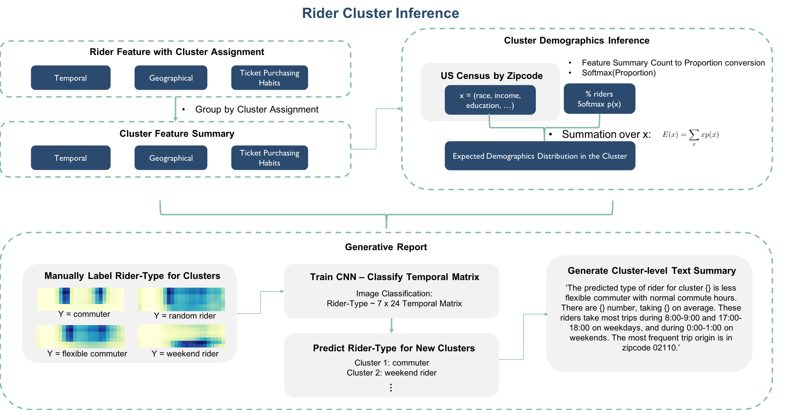

## Contents
{:.no_toc}
*  
{: toc}

## Cluster Inference Workflow

| |
|:--:|
| ***Figure 1: Rider Cluster Inference*** |

## Cluster Pattern-of-Use Feature Summary
The input of the cluster inference module is the end result of the segmentation procedure, which is a large data frame where each row is a rider and the columns are rider pattern-of-use features plus a cluster assignment. To summarize cluster pattern-of-use, we took the within cluster sum of individual features and divided by the total number of trips of this cluster. This gives a distribution of within cluster traffic. In the end, we have a data frame where each row is a cluster and the columns are the summarized cluster-level pattern-of-use features.

## Cluster Demographics Distribution
To infer cluster-level demographics distribution, we first converted the geographical trip count features associated with each zip code into proportions and took a softmax transformation. In this way, the cluster-level geographical usage features are converted into a probability distribution over zip codes for each cluster. With this probability distribution, we then incorporated the US census data (by zip codes) to obtain an expected demographics distribution for each cluster.

## Automatically Generated Cluster Summary (Generative Report)

To facilitate business insight development, we also developed an auto report generator based on convolutional neural network (CNN) that summarizes each cluster's pattern-of-use in the form of a short text paragraph. To train the CNN model, we first manually labeled clusters as one of the 7 pre-defined rider types (see below) based on the cluster's 7 by 24 temporal matrix. This serves as the basis for our training samples.

- **7 Pre-defined Rider-Types**
> - random riders
> - weekend riders
> - less flexible commuters with normal commute hours
> - less flexible commuters with early commute hours
> - more flexible commuters with normal commute hours
> - more flexible commuters with early commute hours
> - weekend riders who also ride over weekdays

 We then oversampled each labeled training data 500 times by adding a Gaussian noise (mean = 0, std = 0.2) to the original time matrix for better generalization performance. The CNN model was trained on this expanded labeled training data.

Finally, the automatically generated summary text uses string formatting to report the predicted rider-type, which is the prediction from the trained CNN model, and a few cluster statistics including the cluster size, the average number of trips, and the weekday / weekend hours as well as the zip code that show the most traffic.

## Summary Findings
We were able to verify that the found clusters indeed differ in their usage patterns as well as their inferred demographics distributions. Furthermore, the auto report generator appears to work well based on the text it generates and that the validation accuracy of the CNN model approached as high as 0.99.
